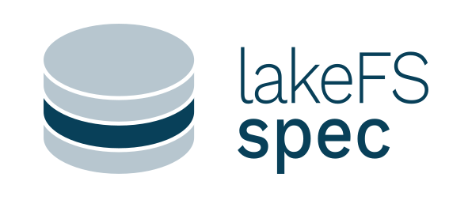

<picture>
  <source media="(prefers-color-scheme: dark)" srcset="docs/_images/lakefs-spec-logo-light.png">
  
</picture>

# lakeFS-spec: An fsspec backend for lakeFS

[](https://pypi.org/project/lakefs-spec)  [](https://lakefs-spec.org)
 

Welcome to lakeFS-spec, a [filesystem-spec](https://github.com/fsspec/filesystem_spec) backend implementation for the [lakeFS](https://lakefs.io/) data lake.
Our primary goal is to streamline versioned data operations in lakeFS, enabling seamless integration with popular data science tools such as Pandas, Polars, and DuckDB directly from Python.

Highlights:

- Simple repository operations in lakeFS
- Easy access to underlying storage and versioning operations
- Seamless integration with the fsspec ecosystem
- Directly access lakeFS objects from popular data science libraries (including Pandas, Polars, DuckDB, Hugging Face Datasets, PyArrow) with minimal code
- Transaction support for reliable data version control
- Smart data transfers through client-side caching (up-/download)
- Auto-discovery configuration

> [!NOTE]
> We are seeking early adopters who would like to actively participate in our feedback process and shape the future of the library.
If you are interested in using the library and want to get in touch with us, please reach out via [Github Discussions](https://github.com/aai-institute/lakefs-spec/discussions).

## Installation

lakeFS-spec is published on PyPI, you can simply install it using your favorite package manager:

```shell
$ pip install lakefs-spec
  # or, for example with uv:
$ uv add lakefs-spec
```

## Usage

The following usage examples showcase two major ways of using lakeFS-spec: as a low-level filesystem abstraction, and through third-party (data science) libraries.

For a more thorough overview of the features and use cases for lakeFS-spec, see the [user guide](https://lakefs-spec.org/latest/guides/) and [tutorials](https://lakefs-spec.org/latest/tutorials/) sections in the documentation.

### Low-level: As a fsspec filesystem 

The following example shows how to upload a file, create a commit, and read back the committed data using the bare lakeFS filesystem implementation.
It assumes you have already created a repository named `repo` and have `lakectl` credentials set up on your machine in `~/.lakectl.yaml` (see the [lakeFS quickstart guide](https://docs.lakefs.io/quickstart/) if you are new to lakeFS and need guidance).

```python
from pathlib import Path

from lakefs_spec import LakeFSFileSystem

REPO, BRANCH = "repo", "main"

# Prepare example local data
local_path = Path("demo.txt")
local_path.write_text("Hello, lakeFS!")

# Upload to lakeFS and create a commit
fs = LakeFSFileSystem()  # will auto-discover config from ~/.lakectl.yaml

# Upload a file on a temporary transaction branch
with fs.transaction(repository=REPO, base_branch=BRANCH) as tx:
    fs.put(local_path, f"{REPO}/{tx.branch.id}/{local_path.name}")
    tx.commit(message="Add demo data")

# Read back committed file
f = fs.open(f"{REPO}/{BRANCH}/demo.txt", "rt")
print(f.readline())  # "Hello, lakeFS!"
```

### High-level: Via third-party libraries

A variety of widely-used data science tools are building on fsspec to access remote storage resources and can thus work with lakeFS data lakes directly through lakeFS-spec (see the [fsspec docs](https://filesystem-spec.readthedocs.io/en/latest/#who-uses-fsspec) for details).
The examples assume you have a lakeFS instance with the [`quickstart` repository](https://docs.lakefs.io/quickstart/launch.html) containing sample data available.

```python
# Pandas -- see https://pandas.pydata.org/docs/user_guide/io.html#reading-writing-remote-files
import pandas as pd

data = pd.read_parquet("lakefs://quickstart/main/lakes.parquet")
print(data.head())


# Polars -- see https://pola-rs.github.io/polars/user-guide/io/cloud-storage/
import polars as pl

data = pl.read_parquet("lakefs://quickstart/main/lakes.parquet", use_pyarrow=True)
print(data.head())


# DuckDB -- see https://duckdb.org/docs/guides/python/filesystems.html
import duckdb
import fsspec

duckdb.register_filesystem(fsspec.filesystem("lakefs"))
res = duckdb.read_parquet("lakefs://quickstart/main/lakes.parquet")
res.show()
```

## Contributing

We encourage and welcome contributions from the community to enhance the project.
Please check [discussions](https://github.com/aai-institute/lakefs-spec/discussions) or raise an [issue](https://github.com/aai-institute/lakefs-spec/issues) on GitHub for any problems you encounter with the library.

For information on the general development workflow, see the [contribution guide](CONTRIBUTING.md).

## License

The lakeFS-spec library is distributed under the [Apache-2 license](https://github.com/aai-institute/lakefs-spec/blob/main/LICENSE).
